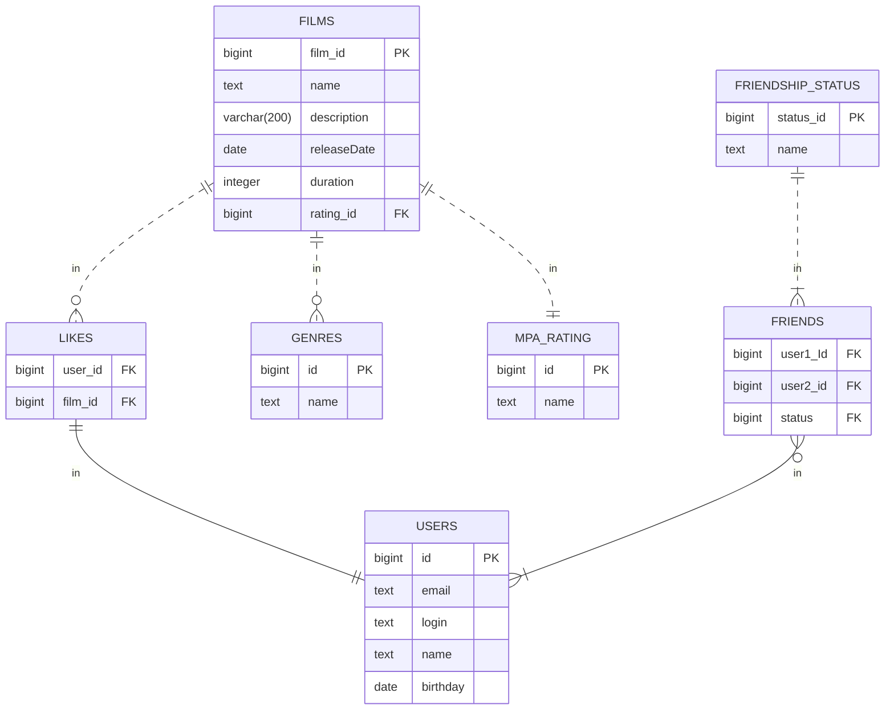

## java-filmorate
Template repository for Filmorate project.
## ER-диаграмма

```mermaid
erDiagram
    FILMS{
        bigint film_id PK
        text name
        varchar(200) description
        date releaseDate
        integer duration
        bigint rating_id FK
    }
    
    
    LIKES {
        bigint user_id FK
        bigint film_id FK
    }
    GENRES {
        bigint id PK
        text name
    }
    MPA_RATING {
        bigint id PK
        text name
    }
    USERS {
        bigint id PK
        text email
        text login
        text name
        date birthday
    }
    FRIENDS {
        bigint user1_Id FK
        bigint user2_id FK
        bigint status FK
        
    }
    FRIENDSHIP_STATUS {
        bigint status_id PK
        text name
    }
    FILMS || .. o{ LIKES: in
    FILMS || .. || MPA_RATING: in
    LIKES || -- || USERS: in
    FILMS || .. o{ GENRES: in
    FRIENDS }o -- |{ USERS: in
    FRIENDSHIP_STATUS || .. |{ FRIENDS: in
```
#

 

