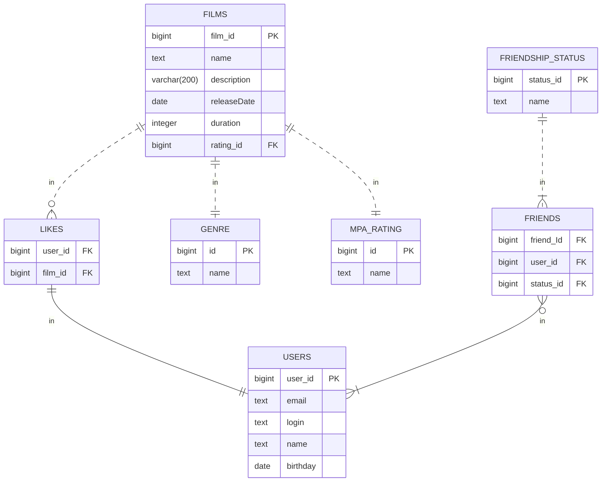

## java-filmorate
Template repository for Filmorate project.
## ER-диаграмма

## Примеры запросов:
Вывести список фильмов:  
SELECT *
FROM FILM;

Вывести все фильмы с id жанра 1:  
SELECT*  
FROM FILM  
WHERE genre_id = 1;

Вывеcти название фильмов и количество лайков для них:  
SELECT f.description,  
COUNT(l.like_id) AS likes_count  
FROM LIKE AS l  
LEFT OUTER JOIN FILM AS f ON l.film_id = f.film_id  
GROUP BY f.description;

Вывести названия ТОП-10 самых популярных фильмов:  
SELECT f.description,  
COUNT(l.like_id) AS likes_count  
FROM like AS l  
LEFT OUTER JOIN film AS f ON l.film_id = f.film_id  
GROUP BY f.description
ORDER BY likes_count DESC
LIMIT 10;

Вывести список пользователей:  
SELECT *
FROM USER;

Вывести id друзей пользователя с id 1:  
SELECT friend_id  
FROM friend  
WHERE user_id = 1;

Вывести статус дружбы пользователя с id = 1 и друга с id = 2  
SELECT fs.name AS friendship_status  
FROM friend AS f
LEFT OUTER JOIN friendship_status AS fs ON f.status_id = fs.status_id  
WHERE user_id = 1 AND friend_id = 2;

Вывести список пользвателей с их именами и количеством друзей, отсортиовать полученный списко по убыванию количества друзей:  
SELECT u.name,  
COUNT(f.friend_id) AS count_friend  
FROM friend AS f  
LEFT OUTER JOIN user AS u ON f.user_id = u.user_id  
GROUP BY u.name  
ORDER BY count_friend DESC;  

 

